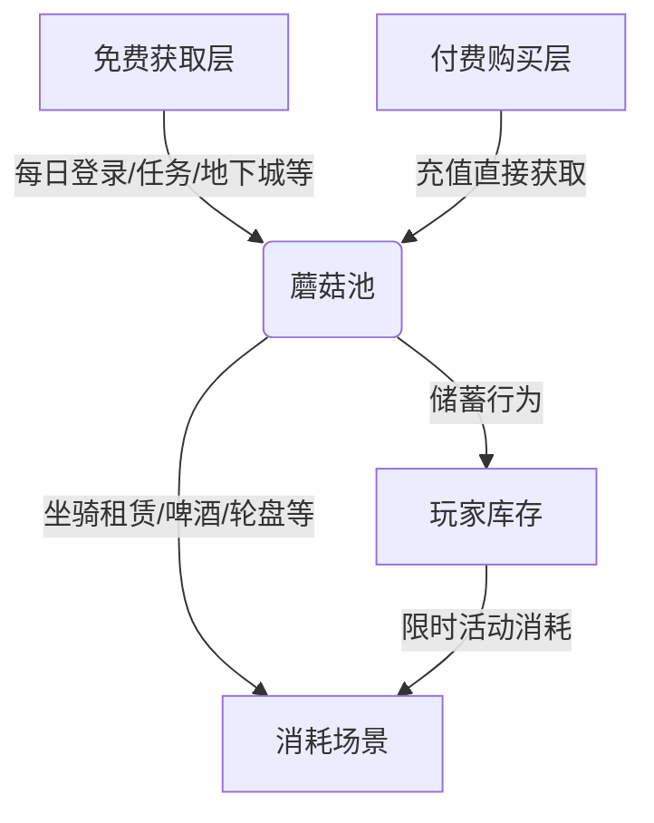

# SF_MON_01 蘑菇经济体系
> 文档版本：v1.0
> 更新日期：2026-04-29
> 定位：Shakes and Fidget 高级货币（Premium Currency）经济系统设计分析

## 1. 蘑菇概览
### 1.1 核心定位
- 游戏内唯一高级货币（Premium Currency），无直接金币兑换通道（金币为软通货，蘑菇为硬通货）🅰️官方
- 承担付费层所有消耗场景的结算职能，免费层仅能通过有限途径获取
- 与金币的经济隔离设计：避免通胀传导，保证付费价值稳定性

### 1.2 获取/消耗平衡总览

> 流程图说明：蘑菇池由免费获取与付费充值共同注入，核心消耗场景集中在付费层，储蓄行为受低门槛租赁道具（如狮鹫）激励

## 2. 蘑菇获取途径（免费层）
### 2.1 每日登录奖励
- 固定奖励：1个/天，连续登录无额外加成🅰️官方
- 月均获取：30个（按30天计）🅰️官方

### 2.2 任务掉落
- 基础概率：每分钟任务1%基础掉落率🅲逆向
- 实际概率：叠加口渴值加成后约8%/任务🅱️社区
- 假设日均完成30个任务：30*8%=2.4个/天，月均72个🅳推测
- 数据缺口：不同等级任务的基础掉落概率差异未明确

### 2.3 地下城奖励
- Boss掉落：每个地下城最终Boss有概率掉落1个蘑菇，周均约2个🅱️社区
- 月均获取：8个🅳推测

### 2.4 远征里程碑
- 奖励规则：每完成10次远征奖励1个蘑菇🅱️社区
- 每周上限：最多完成50次远征（按游戏设定）🅰️官方
- 周均获取：5个，月均20个🅳推测

### 2.5 女巫大锅捐赠
- 随机回报：捐赠材料后有概率获得蘑菇，月均约1个🅱️社区
- 数据缺口：具体概率未公开🅲逆向未验证

### 2.6 收藏册完成奖励
- 部分收藏册章节完成后奖励1-2个蘑菇，月均约1个🅱️社区

### 2.7 成就系统
- 高阶成就完成后偶尔奖励蘑菇，月均约1个🅱️社区

### 2.8 Offer Wall 广告
- 完成第三方广告任务获取，月均约5个（按活跃玩家计算）🅳推测
- 数据缺口：不同地区Offer Wall任务量差异大

### 2.9 运营活动额外蘑菇
- 固定活动：Black Friday +20%/+33% 充值返利，Crazy Mushroom Harvest 等活动额外赠送🅰️官方
- 月均额外获取：约5个（按年均活动频率计算）🅳推测

### 2.10 免费获取总量估算（零氪玩家月均）
| 途径 | 月均获取量 | 可信度 |
|------|------------|--------|
| 每日登录 | 30 | 🅰️ |
| 任务掉落 | 72 | 🅳 |
| 地下城 | 8 | 🅳 |
| 远征里程碑 | 20 | 🅳 |
| 女巫大锅 | 1 | 🅳 |
| 收藏册 | 1 | 🅳 |
| 成就 | 1 | 🅳 |
| Offer Wall | 5 | 🅳 |
| 运营活动 | 5 | 🅳 |
| **合计** | **143个/月** | 🅳 |

> 说明：零氪玩家月均免费获取约143个蘑菇，波动范围±20%（受活动参与度、任务完成效率影响）

## 3. 蘑菇消耗场景（付费层）
### 3.1 坐骑租赁
| 坐骑 | 租赁价格 | 租赁周期 | 日均成本 | 可信度 |
|------|----------|----------|----------|--------|
| 狮鹫 | 25蘑菇 | 14天 | 1.78个/天 | 🅰️ |
| 飞龙 | 50蘑菇 | 14天 | 3.57个/天 | 🅰️ |
| 凤凰 | 150蘑菇 | 14天 | 10.71个/天 | 🅰️ |

### 3.2 啤酒购买
- 兑换比例：1蘑菇=1杯啤酒🅰️官方
- 每日上限：基础10杯/天，可通过蘑菇扩充至额外20杯，总上限30杯/天🅰️官方
- 满额消耗：30蘑菇/天，月均900蘑菇🅳推测

### 3.3 幸运轮盘
- 规则：首次免费，后续1蘑菇/次，每日20次上限🅰️官方
- 满额消耗：20蘑菇/天，月均600蘑菇🅳推测

### 3.4 里程碑礼包
- 消耗：购买各级里程碑礼包，价格梯度未公开🅲逆向
- 数据缺口：具体礼包价格、包含内容未披露

### 3.5 装备外观修改
- 消耗：10蘑菇/件（仅限史诗/传奇装备）🅱️社区
- 月均消耗（按修改2件计）：20蘑菇🅳推测

### 3.6 堡垒加速建造
- 消耗：按加速时长比例消耗，具体比例未公开🅳推测
- 数据缺口：1小时加速对应蘑菇消耗未明确

### 3.7 公会突袭额外行动
- 消耗：每次额外行动1蘑菇🅱️社区
- 数据缺口：每日额外行动次数上限未明确

### 3.8 活动替代消耗
- 示例：地狱电梯钥匙卡1个=1蘑菇🅱️社区
- 月均消耗（按活动参与度）：10-50蘑菇🅳推测

### 3.9 消耗总量估算
| 玩家类型 | 日均消耗 | 月均消耗 | 可信度 |
|----------|----------|----------|--------|
| 微氪（仅买基础啤酒+偶尔轮盘） | 5个 | 150个 | 🅳 |
| 中氪（租赁狮鹫+满额啤酒） | 20个 | 600个 | 🅳 |
| 重氪（租赁凤凰+满额轮盘+礼包） | 50个 | 1500个 | 🅳 |

> 说明：零氪玩家月均免费获取143个，刚好覆盖微氪级消耗，付费玩家需通过充值补充差额

## 4. 经济平衡分析
### 4.1 免费获取与核心消耗的比例
- 零氪月均获取143个，核心消耗（狮鹫租赁25个/14天=53个/月）占比37%，剩余蘑菇可覆盖啤酒、轮盘等小额消耗
- 付费玩家充值后，消耗上限远高于免费获取，形成付费动力

### 4.2 "存蘑菇"行为的激励机制
- 锚定目标：狮鹫25个/14天的低门槛租赁，形成"存25个就能用14天"的明确目标，日均需存1.78个，与免费获取速率匹配
- 限时性：租赁道具到期需重新购买，推动持续储蓄或小额充值

### 4.3 经济通胀/紧缩控制机制
- 通胀控制：免费获取有严格上限（零氪月均143个），消耗场景多元化，避免蘑菇囤积
- 紧缩应对：推出限时高价值消耗活动（如凤凰租赁150个/14天），刺激存量蘑菇消耗
- 动态调节：运营活动通过调整赠送比例，平衡市场蘑菇存量

### 4.4 蘑菇经济对玩家行为的影响
- 正向：推动每日登录、任务完成、远征参与，提升活跃度
- 负向：零氪玩家与付费玩家的体验差距受坐骑租赁影响，需通过免费任务掉落缩小差距
- 付费转化：低门槛储蓄目标（狮鹫）降低首次付费阻力，推动微氪向中氪转化

## 5. 数据来源与可信度
### 5.1 来源列表
1. 游戏内官方设定（🅰️）：登录奖励、坐骑价格、啤酒规则等
2. 社区Wiki（🅱️）：任务掉落概率、地下城奖励、外观修改价格等
3. 逆向工程数据（🅲）：任务基础掉落率、里程碑礼包梯度等
4. 推测（🅳）：月均获取/消耗估算、未公开数据推导

### 5.2 数据缺口清单
1. 不同等级任务的基础掉落概率差异
2. 堡垒加速建造的具体消耗比例
3. 公会突袭额外行动的次数上限
4. 里程碑礼包的完整价格梯度
5. 不同地区Offer Wall的任务量与奖励差异

---
> 文档结束