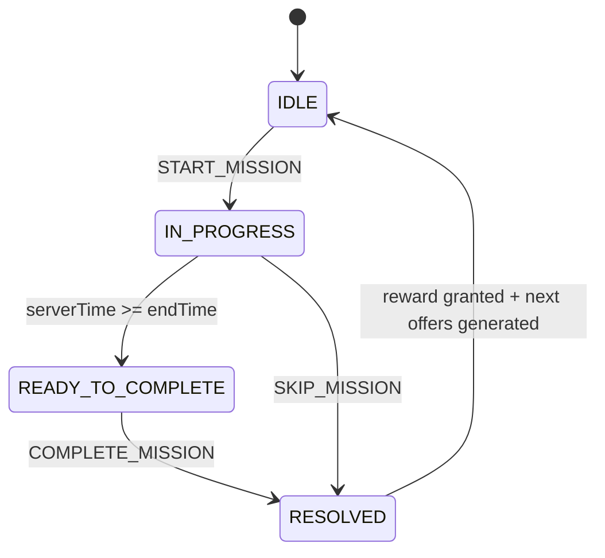

# GDD_Tavern_Mission_Hub_Classic_SF_V4.md

**状态:** 正式开发规格 / Server-Client Contract  
**版本:** V4.0 Classic Quest Production  
**目标:** 复刻经典 Shakes & Fidget 酒馆三选一任务节奏；仅 UI、美术、文案、题材做“大宋造反模拟器”本地化换皮。  
**适用对象:** Server Agent、Client Agent、Content Agent、QA Agent  
**当前接口基础:** 项目现有统一 `POST /api/action` 动作分发，不拆成多 REST endpoint。  

---

## 0. 设计原则

### 0.1 本文档目标
本 GDD 不是 MVP 原型，而是正式酒馆任务系统的生产规格。Server Agent 和 Client Agent 必须按本文档实现，并通过文末验收用例。

### 0.2 对齐的经典机制
本文档对齐的是经典 S&F `Quests` 模式，而不是新版 `Expeditions` 模式。

经典酒馆任务核心为：

1. 客栈/酒馆提供 3 个可选任务。
2. 每个任务展示耗时、经验、金币/铜钱、可能的装备或特殊掉落。
3. 任务消耗每日冒险精力，即本文档中的“干粮/Thirst”。
4. 坐骑缩短任务时间，并因此节省干粮消耗，使同一天能完成更多任务。
5. 每日基础干粮 100 分钟，买酒每次恢复 20 分钟，每日最多 10 次。
6. 任务倒计时结束后进入战斗结算，成功后获得奖励。
7. 任务列表不能靠刷新页面反复重抽。

### 0.3 法务与产品边界
可以复刻“异步任务 + 干粮 + 三选一 + 坐骑提效 + 战斗结算 + 掉落”的机制骨架，但不得复制 S&F 的商标、角色、美术、文案、UI 布局细节、任务文本、装备名称、怪物名称。本文档中的所有显示名都应转换成“大宋造反模拟器”的世界观表达。

---

## 1. 名词映射

| 经典 S&F 概念 | 本项目显示名 | 后端字段建议 | 说明 |
|---|---|---|---|
| Tavern | 客栈 | `tavern` | 酒馆任务入口 |
| Quest | 差事 / 密谋任务 | `mission` | 三选一任务 |
| Thirst for Adventure | 干粮 / 精力 | `thirstSecRemaining` | 内部用秒，UI 可显示为点数/分钟 |
| Beer | 买酒 / 喝茶 / 加干粮 | `TAVERN_DRINK` | 消耗通宝，恢复 20 分钟干粮 |
| Mushroom | 通宝 | `premiumCurrency` | 付费/稀缺货币 |
| Gold | 铜钱 | `gold` | 普通货币 |
| Mount | 坐骑 | `mount.speedMultiplier` | 任务时间倍率 0.9/0.8/0.7/0.5 |
| Quicksand Hourglass | 沙漏 / 更漏牌 | `hourglass` | 跳过倒计时资源 |
| Dungeon Key | 衙牢密钥 / 密道图 | `dungeonKey` | 副本解锁掉落 |
| Red Quest | 血色差事 / 高危密令 | `isRedQuest` | 更难，更高奖励 |

---

## 2. 现有动作接口兼容要求

项目当前所有游戏交互通过统一动作接口分发：

```http
POST /api/action
Content-Type: application/json
Authorization: Bearer <token>
```

请求格式：

```json
{
  "action": "ACTION_NAME",
  "payload": {}
}
```

当前已有动作名：

- `START_MISSION`
- `COMPLETE_MISSION`
- `SKIP_MISSION`
- `TAVERN_DRINK`
- `GENERATE_MISSIONS`

### 2.1 本版本不拆 endpoint
Server Agent 不要改成：

```http
GET /api/tavern/info
POST /api/tavern/accept
POST /api/tavern/claim
```

应继续使用：

```http
POST /api/action
```

### 2.2 建议新增动作
为避免 Client 进入客栈时缺少一次标准同步动作，正式版建议新增：

```ts
TAVERN_GET_INFO
```

如果项目已有全局 `GET_PROFILE` 或 `SYNC_GAME_STATE`，可以不新增，但必须保证 Client 进入客栈时能拿到完整 tavern state。

---

## 3. 核心循环

### 3.1 玩家体验流程

```text
进入客栈
  ↓
服务端返回当前干粮、买酒次数、坐骑倍率、当前任务状态、三选一任务
  ↓
玩家从 3 个任务中选择 1 个
  ↓
服务端校验干粮 → 扣除干粮 → 锁定任务快照 → 写入 activeMission
  ↓
Client 展示倒计时
  ↓
倒计时结束
  ↓
Client 请求 COMPLETE_MISSION
  ↓
Server 计算/读取战斗结果 → 发放奖励 → 清理 activeMission → 生成下一组三选一任务
  ↓
Client 播放战斗和领奖表现
  ↓
回到三选一
```

### 3.2 状态机



### 3.3 状态定义

| 状态 | 后端含义 | Client 显示 |
|---|---|---|
| `IDLE` | 无进行中任务，有或可生成 3 个 offers | 显示三选一任务 |
| `IN_PROGRESS` | 有 activeMission，未到 endTime | 显示倒计时、可跳过 |
| `READY_TO_COMPLETE` | activeMission 已到 endTime，尚未结算 | 显示“完成/领取/查看结果” |
| `RESOLVED` | 服务端已结算，本状态不长期持久化 | Client 播放战斗和奖励动画 |

> 说明：`RESOLVED` 推荐作为响应态，不作为长期数据库状态。服务端完成结算后应立即回到 `IDLE`，并生成下一组三选一任务。

---

## 4. 干粮 / Thirst 系统

### 4.1 内部单位
正式版一律用“秒”存储干粮，避免 2.5 分钟、7.5 分钟等坐骑缩短后的精度问题。

```ts
type ThirstSec = number;
```

### 4.2 每日基础值

```ts
DAILY_BASE_THIRST_SEC = 100 * 60; // 6000 秒
```

每日 0 点重置：

```ts
thirstSecRemaining = 100 * 60;
beerUsedToday = 0;
firstMissionPremiumGranted = false;
dailyQuestCount = 0;
```

### 4.3 买酒恢复

```ts
BEER_RECOVER_THIRST_SEC = 20 * 60;
BEER_LIMIT_PER_DAY = 10;
BEER_COST_PREMIUM = 1;
```

`TAVERN_DRINK` 成功后：

```ts
premiumCurrency -= 1;
thirstSecRemaining += 20 * 60;
beerUsedToday += 1;
```

### 4.4 买酒上限

```ts
maxDailyThirstSec = 100 * 60 + beerLimitToday * 20 * 60 + bonusBeerSec;
```

第一期正式版：

```ts
bonusBeerSec = 0;
beerLimitToday = 10;
```

后续若实现“装备附魔免费酒/额外酒”，只通过 `bonusBeerSec` 或 `freeBeerAvailableToday` 扩展，不要改主循环。

### 4.5 Client UI 显示
Client 可以显示为：

```text
干粮：87.5 / 300
```

也可以显示为：

```text
今日可行动：87分30秒
```

建议第一版显示：

```text
干粮 87.5
```

其中：

```ts
displayThirst = thirstSecRemaining / 60;
```

---

## 5. 坐骑机制

### 5.1 坐骑倍率

| 坐骑档位 | 大宋显示名建议 | `speedMultiplier` | 效果 |
|---|---|---:|---|
| 低档 | 驴 / 瘦马 | 0.9 | 任务时间 -10% |
| 中档 | 快马 | 0.8 | 任务时间 -20% |
| 高档 | 骏马 / 黑风马 | 0.7 | 任务时间 -30% |
| 顶档 | 神驹 / 夜照玉狮子 | 0.5 | 任务时间 -50% |

### 5.2 核心公式

任务有两个时间概念：

```ts
rawDurationMin       // 原始任务档位，用于奖励预算
actualDurationSec    // 坐骑缩短后的真实倒计时
effectiveThirstCost  // 实际消耗干粮
```

公式：

```ts
actualDurationSec = rawDurationMin * 60 * mount.speedMultiplier;
effectiveThirstCostSec = actualDurationSec;
```

重要：奖励预算按 `rawDurationMin` 计算，不按 `actualDurationSec` 计算。这样 -50% 坐骑的价值才是“同样一天干粮能跑约两倍任务”，而不是单纯少等。

### 5.3 示例

| 原始任务 | 无坐骑 | -50% 坐骑 |
|---:|---:|---:|
| 5 分钟 | 消耗 5 干粮，等 5 分钟 | 消耗 2.5 干粮，等 2.5 分钟 |
| 10 分钟 | 消耗 10 干粮，等 10 分钟 | 消耗 5 干粮，等 5 分钟 |
| 20 分钟 | 消耗 20 干粮，等 20 分钟 | 消耗 10 干粮，等 10 分钟 |

---

## 6. 任务时长档位

### 6.1 16 级及以上
经典任务的正式档位：

```ts
CLASSIC_DURATIONS_MIN = [5, 10, 15, 20];
```

### 6.2 1-15 级新手期
公开资料不足以确认每一级精确档位，本项目必须使用配置表，而不是硬编码公式。

```ts
LOW_LEVEL_DURATION_TABLE = {
  1:  [1, 2, 3, 5],
  2:  [1, 2, 3, 5],
  3:  [2, 3, 5, 10],
  4:  [2, 3, 5, 10],
  5:  [2, 3, 5, 10],
  6:  [3, 5, 10, 15],
  7:  [3, 5, 10, 15],
  8:  [3, 5, 10, 15],
  9:  [3, 5, 10, 15],
  10: [5, 10, 15, 20],
  11: [5, 10, 15, 20],
  12: [5, 10, 15, 20],
  13: [5, 10, 15, 20],
  14: [5, 10, 15, 20],
  15: [5, 10, 15, 20]
};
```

> 注意：上表是工程默认表，用于保证正式系统可运行。若后续通过人工采样得到更精确的经典档位，只更新配置，不改代码。

---

## 7. 三选一任务生成

### 7.1 生成时机

只在以下情况生成 3 个任务：

1. 玩家首次进入客栈且没有 `missionOffers`。
2. 玩家完成当前任务并领奖后。
3. 每日重置后，如果玩家处于 `IDLE` 且没有进行中任务。
4. Debug/后台补偿明确要求重置。

禁止：

```text
每次打开客栈页面就重新随机 3 个任务。
```

否则玩家可以反复刷新页面刷最优任务，破坏经典任务选择压力。

### 7.2 offerSet
每组三选一必须有唯一 `offerSetId`。

```ts
offerSetId = hash(playerId + tavern.offerSeq + serverSecret + gameDay);
```

三条 mission 的 `missionId` 从 `offerSetId` 派生：

```ts
missionId = hash(offerSetId + slotIndex);
```

### 7.3 随机数
所有任务生成使用服务端 deterministic PRNG：

```ts
seed = hash(playerId + offerSeq + serverSecret);
rng = seededRandom(seed);
```

Client 不得参与任何任务奖励随机。

### 7.4 任务结构

```ts
type MissionOffer = {
  missionId: string;
  offerSetId: string;
  slotIndex: 0 | 1 | 2;

  templateId: string;
  title: string;
  description: string;
  giverName: string;
  locationId: string;

  rawDurationMin: 5 | 10 | 15 | 20 | number;
  mountMultiplier: number;
  actualDurationSec: number;
  thirstCostSec: number;

  rewardPreview: {
    xp: number;
    gold: number;
    itemPreview?: ItemPreview;
    premiumCurrency?: number;
    hourglass?: number;
    dungeonKeyId?: string;
  };

  difficultyTier: "normal" | "red";
  enemySnapshot: EnemySnapshot;
  combatSeed: string;

  generatedAt: string;
};
```

### 7.5 生成算法概览

```ts
function generateMissionOffers(player: Player): MissionOffer[] {
  applyDailyResetIfNeeded(player);

  if (player.tavern.activeMission) return player.tavern.missionOffers;
  if (player.tavern.missionOffers.length === 3) return player.tavern.missionOffers;

  const rng = createSeededRng(player.id, player.tavern.offerSeq, serverSecret);
  const offers = [];

  for (let slot = 0; slot < 3; slot++) {
    const rawDurationMin = pickDurationByLevel(player.level, rng);
    const rewardStyle = pickRewardStyle(rng);
    const difficultyTier = maybeRedQuest(player.level, rng);

    const reward = calculateQuestReward({
      player,
      rawDurationMin,
      rewardStyle,
      difficultyTier,
      rng
    });

    const extraReward = rollExtraReward({ player, rawDurationMin, rng });

    offers.push(buildMissionOffer({
      player,
      slot,
      rawDurationMin,
      reward,
      extraReward,
      difficultyTier,
      rng
    }));
  }

  enforceOfferSetQuality(offers, player, rng);
  persistOffers(player, offers);
  return offers;
}
```

### 7.6 三选一不固定职位
禁止把三个任务固定成：

```text
第 1 个永远经验高
第 2 个永远铜钱高
第 3 个永远均衡/掉落
```

正式版应做到：

1. 三个任务的时长、XP/min、Gold/min、掉落均随机波动。
2. 每组三选一至少有一个“看起来值得选”的任务。
3. 每组三选一可以出现明显诱惑项：装备、钥匙、高经验、高铜钱、红色高危任务。
4. 玩家需要计算和权衡，而不是机械点击固定位置。

---

## 8. 奖励计算

### 8.1 奖励预算原则
奖励基于：

```text
玩家等级 + 原始任务时长 + 奖励倾向 + 任务难度 + 公会/事件/装备加成
```

不是基于坐骑缩短后的时间。

### 8.2 奖励风格

```ts
type RewardStyle =
  | "xp_high"
  | "gold_high"
  | "balanced"
  | "item_bait"
  | "low_roll"
  | "high_roll";
```

推荐权重：

```ts
REWARD_STYLE_WEIGHTS = {
  xp_high: 25,
  gold_high: 25,
  balanced: 30,
  item_bait: 10,
  low_roll: 5,
  high_roll: 5
};
```

### 8.3 基础曲线
正式项目不要把 XP/铜钱公式写死在业务逻辑里，应使用可调配置。

```ts
type QuestRewardCurve = {
  level: number;
  xpPerRawMinuteBase: number;
  goldPerRawMinuteBase: number;
};
```

第一期可以用公式生成默认曲线，但必须允许后续用采样表覆盖：

```ts
xpBase = rawDurationMin * getXpPerMinute(player.level);
goldBase = rawDurationMin * getGoldPerMinute(player.level);
```

### 8.4 风格倍率

```ts
const STYLE_MULTIPLIERS = {
  xp_high:    { xp: [1.25, 1.65], gold: [0.45, 0.85] },
  gold_high:  { xp: [0.45, 0.85], gold: [1.25, 1.65] },
  balanced:   { xp: [0.85, 1.15], gold: [0.85, 1.15] },
  item_bait:  { xp: [0.70, 1.05], gold: [0.70, 1.05], itemChanceBonus: true },
  low_roll:   { xp: [0.50, 0.80], gold: [0.50, 0.80] },
  high_roll:  { xp: [1.30, 1.80], gold: [1.30, 1.80] }
};
```

### 8.5 加成顺序
服务端按固定顺序应用加成，避免不同模块重复乘算。

```text
基础奖励
→ 任务风格倍率
→ 红色任务倍率
→ 公会 XP/Gold 加成
→ 装备/附魔/符文加成
→ 周末/活动倍率
→ 四舍五入
```

### 8.6 奖励响应必须包含 breakdown
Server 返回奖励时必须给 Client 一个简化 breakdown，方便调试和 UI 展示。

```ts
rewardBreakdown: {
  baseXp: number;
  styleXpMultiplier: number;
  guildXpMultiplier: number;
  eventXpMultiplier: number;
  finalXp: number;

  baseGold: number;
  styleGoldMultiplier: number;
  guildGoldMultiplier: number;
  eventGoldMultiplier: number;
  finalGold: number;
}
```

---

## 9. 额外掉落

### 9.1 掉落类型

```ts
type ExtraReward =
  | { type: "none" }
  | { type: "equipment"; item: Equipment }
  | { type: "premiumCurrency"; amount: number }
  | { type: "hourglass"; amount: number }
  | { type: "dungeonKey"; keyId: string }
  | { type: "resource"; resourceId: string; amount: number };
```

### 9.2 每日第一趟通宝
正式版保留“每日第一趟任务保底稀缺货币”的经典钩子。

```ts
if (!player.tavern.firstMissionPremiumGranted && missionSuccess) {
  extraRewards.push({ type: "premiumCurrency", amount: 1, reason: "daily_first_mission" });
  player.tavern.firstMissionPremiumGranted = true;
}
```

UI 文案建议：

```text
今日第一趟差事，额外获得 1 枚通宝。
```

### 9.3 装备掉落
装备生成应使用已有 `ItemGenerator`，不要在 Tavern 模块里私自生成属性。

```ts
item = ItemGenerator.generate({
  playerLevel: player.level,
  source: "tavern_mission",
  rarityBias,
  slotBias,
  rng
});
```

### 9.4 钥匙掉落
钥匙只在满足条件时进入掉落池：

```ts
canDropDungeonKey(player, keyId) === true
```

条件包括：

1. 玩家等级达到要求。
2. 前置副本/章节未解锁。
3. 玩家背包和账号状态中没有同一 key。
4. 当前任务允许特殊掉落。

### 9.5 掉落预览
经典体验中，部分奖励会在任务卡上直接显示，部分为隐藏掉落。正式版建议：

| 掉落 | 是否预览 | 原因 |
|---|---|---|
| XP/铜钱 | 必须显示 | 三选一决策基础 |
| 装备 | 可显示图标/问号 | 强诱惑项 |
| 钥匙 | 可显示 | 关键进度项 |
| 每日第一趟通宝 | 可显示或结算时弹出 | 保留惊喜也可 |
| 隐藏通宝/沙漏 | 不显示 | 保留刷短任务动机 |

---

## 10. 红色任务 / 高危任务

### 10.1 定义
红色任务是更高难度、更高奖励的任务。大宋题材中可命名为：

```text
血色密令 / 高危差事 / 官府追缉 / 夜袭粮仓
```

### 10.2 机制

```ts
isRedQuest = rng.chance(redQuestChanceByLevel(player.level));
```

红色任务：

1. 奖励倍率更高。
2. 敌人更强。
3. 失败概率更高。
4. UI 上必须明显标红或带警告。

### 10.3 推荐默认值

```ts
RED_QUEST = {
  unlockLevel: 10,
  baseChance: 0.08,
  xpMultiplier: [1.25, 1.60],
  goldMultiplier: [1.25, 1.60],
  enemyPowerMultiplier: [1.20, 1.45]
};
```

---

## 11. 战斗与成功失败

### 11.1 正式版不能纯前端必胜
正式版应由服务端生成任务敌人快照与战斗种子，任务结束时由服务端计算战斗结果。Client 只播放结果，不参与判定。

### 11.2 敌人快照
任务生成时生成：

```ts
type EnemySnapshot = {
  enemyId: string;
  displayName: string;
  level: number;
  classType: "warrior" | "mage" | "scout" | "beast" | "bandit" | "official";
  attributes: {
    strength: number;
    intelligence: number;
    agility: number;
    constitution: number;
    luck: number;
  };
  weaponDamageMin: number;
  weaponDamageMax: number;
  armor: number;
  hp: number;
};
```

### 11.3 战斗结算

```ts
combatResult = CombatSimulator.run({
  playerSnapshotAtCompletion,
  enemySnapshot,
  combatSeed
});
```

正式版推荐“任务开始时锁敌人，任务完成时读玩家当前属性”。这样玩家在等待期间强化属性，可能帮助战斗，符合成长反馈。

### 11.4 失败奖励
经典体验里任务失败应拿不到主奖励。第一期正式版建议：

```ts
if (!combatResult.playerWon) {
  grantXp = 0;
  grantGold = 0;
  grantExtraRewards = [];
}
```

可选运营配置：失败给少量安慰经验，但默认关闭。

```ts
FAILURE_COMPENSATION_ENABLED = false;
```

---

## 12. 服务端数据模型

### 12.1 Player Tavern State

```ts
type TavernState = {
  gameDay: string; // YYYY-MM-DD, by server realm timezone

  thirstSecRemaining: number;
  beerUsedToday: number;
  beerLimitToday: number;
  firstMissionPremiumGranted: boolean;
  dailyQuestCount: number;

  offerSeq: number;
  missionOffers: MissionOffer[];
  activeMission: ActiveMission | null;

  lastDailyResetAt: string;
  updatedAt: string;
};
```

### 12.2 Active Mission

```ts
type ActiveMission = {
  missionId: string;
  offerSetId: string;
  acceptedAt: string;
  endTime: string;

  rawDurationMin: number;
  actualDurationSec: number;
  thirstCostSec: number;

  rewardSnapshot: RewardSnapshot;
  enemySnapshot: EnemySnapshot;
  combatSeed: string;

  skipUsed: boolean;
  resolved: boolean;
  resolvedAt?: string;
};
```

### 12.3 Reward Snapshot

```ts
type RewardSnapshot = {
  xp: number;
  gold: number;
  previewExtras: ExtraReward[];
  hiddenExtras: ExtraReward[];
  rewardBreakdown: RewardBreakdown;
};
```

### 12.4 为什么要快照
任务开始后，以下内容必须锁定：

1. 任务时长。
2. 消耗干粮。
3. 展示奖励。
4. 敌人基本属性。
5. 战斗随机种子。

否则会出现：升级后奖励漂移、活动倍率跨天错误、刷新页面奖励变化、重复结算等问题。

---

## 13. 动作契约

### 13.1 `TAVERN_GET_INFO`

#### Request

```json
{
  "action": "TAVERN_GET_INFO",
  "payload": {}
}
```

#### Server Logic

1. 鉴权。
2. 加载玩家。
3. `applyDailyResetIfNeeded(player)`。
4. 如果 `IDLE` 且无 offers，生成 3 个任务。
5. 返回 tavern state。

#### Response

```json
{
  "ok": true,
  "data": {
    "serverTime": "2026-04-26T12:00:00.000Z",
    "tavern": {
      "status": "IDLE",
      "thirstSecRemaining": 6000,
      "displayThirst": 100,
      "beerUsedToday": 0,
      "beerLimitToday": 10,
      "firstMissionPremiumGranted": false,
      "mountMultiplier": 0.7,
      "missionOffers": [],
      "activeMission": null
    }
  }
}
```

### 13.2 `GENERATE_MISSIONS`

保留现有动作名，但语义必须是“幂等生成/读取”，而不是强制刷新。

#### Request

```json
{
  "action": "GENERATE_MISSIONS",
  "payload": {}
}
```

#### Server Logic

```text
如果 activeMission 存在：返回当前 activeMission，不生成。
如果 missionOffers 已有 3 个：直接返回已有 offers。
如果 missionOffers 为空：生成 3 个并持久化。
```

#### Response

```json
{
  "ok": true,
  "data": {
    "serverTime": "2026-04-26T12:00:00.000Z",
    "missionOffers": [
      {
        "missionId": "m_001",
        "title": "夜探粮仓",
        "description": "替义军探明官仓守备。",
        "rawDurationMin": 10,
        "actualDurationSec": 420,
        "thirstCostSec": 420,
        "rewardPreview": {
          "xp": 120,
          "gold": 35
        },
        "difficultyTier": "normal"
      }
    ]
  }
}
```

### 13.3 `START_MISSION`

#### Request

```json
{
  "action": "START_MISSION",
  "payload": {
    "missionId": "m_001"
  }
}
```

#### Server Validation

1. 玩家必须处于 `IDLE`。
2. `missionId` 必须存在于当前 `missionOffers`。
3. `missionOffers.offerSetId` 必须有效。
4. `thirstSecRemaining >= mission.thirstCostSec`。
5. 背包不要求有空间，因为奖励在完成时再判断；但如奖励预览含必得装备，可在开始时提示背包空间风险。

#### Server Mutation

```ts
thirstSecRemaining -= mission.thirstCostSec;
activeMission = buildActiveMissionFromOffer(mission);
missionOffers = [];
```

#### Response

```json
{
  "ok": true,
  "data": {
    "serverTime": "2026-04-26T12:00:00.000Z",
    "tavern": {
      "status": "IN_PROGRESS",
      "thirstSecRemaining": 5580,
      "activeMission": {
        "missionId": "m_001",
        "title": "夜探粮仓",
        "acceptedAt": "2026-04-26T12:00:00.000Z",
        "endTime": "2026-04-26T12:07:00.000Z",
        "actualDurationSec": 420,
        "rewardPreview": {
          "xp": 120,
          "gold": 35
        }
      }
    }
  }
}
```

### 13.4 `COMPLETE_MISSION`

#### Request

```json
{
  "action": "COMPLETE_MISSION",
  "payload": {}
}
```

#### Server Logic

1. 无 activeMission：返回错误 `NO_ACTIVE_MISSION`。
2. 当前时间 `< endTime`：返回错误 `MISSION_NOT_READY`，并返回剩余秒数。
3. 如果已结算：返回上次结算结果，不重复发奖。
4. 运行战斗模拟。
5. 胜利则发放 XP、铜钱和掉落。
6. 清理 activeMission。
7. `dailyQuestCount += 1`。
8. 生成下一组三选一 missionOffers。
9. 返回 combatReplay、rewardGranted、nextOffers。

#### Response

```json
{
  "ok": true,
  "data": {
    "serverTime": "2026-04-26T12:07:01.000Z",
    "combatResult": {
      "playerWon": true,
      "rounds": [],
      "enemyName": "巡检司差役"
    },
    "rewardGranted": {
      "xp": 120,
      "gold": 35,
      "extras": [
        { "type": "premiumCurrency", "amount": 1, "reason": "daily_first_mission" }
      ]
    },
    "tavern": {
      "status": "IDLE",
      "thirstSecRemaining": 5580,
      "missionOffers": []
    }
  }
}
```

### 13.5 `SKIP_MISSION`

#### Request

```json
{
  "action": "SKIP_MISSION",
  "payload": {}
}
```

#### Server Logic

正式版跳过优先消耗沙漏；如果没有沙漏，可按运营配置决定是否允许通宝跳过。

```ts
if (player.resources.hourglass > 0) {
  player.resources.hourglass -= 1;
} else if (ALLOW_PREMIUM_SKIP_MISSION) {
  player.resources.premiumCurrency -= 1;
} else {
  throw INSUFFICIENT_HOURGLASS;
}

activeMission.endTime = serverNow;
return completeMission(player);
```

当前项目已实现“消耗 1 通宝立即完成”，若暂时没有沙漏资源，可先设置：

```ts
ALLOW_PREMIUM_SKIP_MISSION = true;
SKIP_PRIORITY = ["premiumCurrency"];
```

但正式长期建议改为：

```ts
SKIP_PRIORITY = ["hourglass", "premiumCurrency_late_night_or_config"];
```

### 13.6 `TAVERN_DRINK`

#### Request

```json
{
  "action": "TAVERN_DRINK",
  "payload": {}
}
```

#### Server Validation

1. `beerUsedToday < beerLimitToday`。
2. `premiumCurrency >= 1`，除非有免费酒。
3. 可以在 `IDLE` 或 `IN_PROGRESS` 状态下买酒；买酒不影响当前 activeMission。

#### Server Mutation

```ts
premiumCurrency -= 1;
thirstSecRemaining += 20 * 60;
beerUsedToday += 1;
```

#### Response

```json
{
  "ok": true,
  "data": {
    "tavern": {
      "thirstSecRemaining": 7200,
      "displayThirst": 120,
      "beerUsedToday": 1,
      "beerLimitToday": 10
    },
    "resources": {
      "premiumCurrency": 99
    }
  }
}
```

---

## 14. Client Agent 开发规格

### 14.1 客栈页面进入
Client 进入客栈时：

```text
调用 TAVERN_GET_INFO
如果无此动作，则调用 GENERATE_MISSIONS 并刷新全局玩家状态
```

Client 不得本地生成任务，不得本地重抽任务。

### 14.2 三选一任务卡
每张任务卡必须显示：

1. 任务标题。
2. 任务描述。
3. 实际耗时：`actualDurationSec`。
4. 干粮消耗：`thirstCostSec / 60`。
5. XP。
6. 铜钱。
7. 装备/钥匙/特殊奖励图标，如果服务端提供 preview。
8. 红色任务标识，如果 `difficultyTier === "red"`。

### 14.3 倒计时
倒计时必须使用服务端时间校准。

```ts
clientServerOffsetMs = Date.parse(serverTime) - Date.now();
remainingMs = Date.parse(endTime) - (Date.now() + clientServerOffsetMs);
```

禁止直接相信本地系统时间。

### 14.4 任务完成按钮
当 `remainingMs <= 0`：

```text
按钮从“密谋中”变为“完成差事”
```

点击后调用：

```ts
COMPLETE_MISSION
```

### 14.5 战斗表现
Client 播放 `combatResult.rounds`。如果服务端暂时只返回 `playerWon` 和 `combatSeed`，Client 可用 combatSeed 生成表现，但不能改变胜负。

### 14.6 领奖表现
服务端已经发奖后，Client 只播放表现：

```text
获得经验 +120
获得铜钱 +35
获得通宝 +1
获得装备：青布护腕
```

如果玩家中途关闭页面，奖励不能丢失，因为服务端已完成发放。

### 14.7 买酒按钮
显示：

```text
买酒补充干粮：1 通宝，+20 干粮，今日 3/10
```

若达到上限，按钮置灰：

```text
今日已饮尽
```

### 14.8 跳过按钮
显示资源优先级：

```text
使用沙漏立即完成
```

如果当前项目先用通宝：

```text
花费 1 通宝立即完成
```

但文案上要留配置，不要写死在 UI。

---

## 15. Server Agent 开发规格

### 15.1 必须实现的服务模块

```text
TavernService
  - getInfo(playerId)
  - generateMissionOffers(player)
  - startMission(player, missionId)
  - completeMission(player)
  - skipMission(player)
  - drink(player)
  - applyDailyResetIfNeeded(player)

MissionGenerator
  - pickDurationByLevel(level, rng)
  - pickRewardStyle(rng)
  - calculateQuestReward(ctx)
  - rollExtraReward(ctx)
  - buildEnemySnapshot(ctx)

CombatSimulator
  - run(playerSnapshot, enemySnapshot, combatSeed)

RewardService
  - grantQuestReward(player, rewardSnapshot, combatResult)

ItemGenerator
  - generate({ playerLevel, source, rarityBias, slotBias, rng })
```

### 15.2 原子事务
以下动作必须在数据库事务中执行：

1. `START_MISSION`
2. `COMPLETE_MISSION`
3. `SKIP_MISSION`
4. `TAVERN_DRINK`
5. `GENERATE_MISSIONS`

事务内必须锁定玩家 tavern state，避免并发请求重复扣除或重复发奖。

### 15.3 幂等要求

| 动作 | 幂等要求 |
|---|---|
| `GENERATE_MISSIONS` | 已有 offers 时返回已有，不重抽 |
| `START_MISSION` | 同一个 missionId 重复请求，如果已进入该 activeMission，可返回当前 activeMission；不能二次扣干粮 |
| `COMPLETE_MISSION` | 重复请求不能重复发奖 |
| `SKIP_MISSION` | 重复请求不能重复扣沙漏/通宝 |
| `TAVERN_DRINK` | 每次点击都是一次购买，不天然幂等；Client 需防连点，Server 需事务校验 |

### 15.4 错误码

```ts
type TavernErrorCode =
  | "TAVERN_NOT_IDLE"
  | "NO_ACTIVE_MISSION"
  | "MISSION_NOT_READY"
  | "MISSION_NOT_FOUND"
  | "MISSION_OFFER_EXPIRED"
  | "INSUFFICIENT_THIRST"
  | "INSUFFICIENT_PREMIUM"
  | "INSUFFICIENT_HOURGLASS"
  | "BEER_LIMIT_REACHED"
  | "INVENTORY_FULL"
  | "DAILY_RESET_APPLIED"
  | "SERVER_TIME_REQUIRED"
  | "ACTION_LOCKED_BY_OTHER_STATE";
```

错误响应格式：

```json
{
  "ok": false,
  "error": {
    "code": "MISSION_NOT_READY",
    "message": "任务尚未完成。",
    "details": {
      "remainingSec": 183
    }
  },
  "data": {
    "serverTime": "2026-04-26T12:03:57.000Z"
  }
}
```

---

## 16. 配置文件建议

建议新增：

```text
/config/classic_tavern.json
```

示例：

```json
{
  "dailyBaseThirstSec": 6000,
  "beerRecoverSec": 1200,
  "beerLimitPerDay": 10,
  "beerCostPremium": 1,
  "durationsByLevel": {
    "default": [5, 10, 15, 20],
    "1": [1, 2, 3, 5],
    "2": [1, 2, 3, 5],
    "3": [2, 3, 5, 10]
  },
  "mounts": {
    "none": 1.0,
    "tier1": 0.9,
    "tier2": 0.8,
    "tier3": 0.7,
    "tier4": 0.5
  },
  "rewardStyleWeights": {
    "xp_high": 25,
    "gold_high": 25,
    "balanced": 30,
    "item_bait": 10,
    "low_roll": 5,
    "high_roll": 5
  },
  "redQuest": {
    "unlockLevel": 10,
    "baseChance": 0.08,
    "xpMultiplierMin": 1.25,
    "xpMultiplierMax": 1.6,
    "goldMultiplierMin": 1.25,
    "goldMultiplierMax": 1.6,
    "enemyPowerMultiplierMin": 1.2,
    "enemyPowerMultiplierMax": 1.45
  },
  "skip": {
    "priority": ["hourglass", "premiumCurrency"],
    "allowPremiumSkip": true,
    "premiumSkipCost": 1
  },
  "dailyFirstMissionPremium": {
    "enabled": true,
    "amount": 1
  }
}
```

---

## 17. 与现有系统的集成

### 17.1 属性系统
任务战斗读取玩家当前属性：

```ts
strength | intelligence | agility | constitution | luck
```

与现有 `UPGRADE_ATTRIBUTE` 保持一致。

### 17.2 背包装备系统
任务掉落装备进入 `inventory`。

如果背包满：

推荐第一版策略：

```text
奖励进入邮件/临时奖励箱，而不是丢失。
```

如果项目暂时没有邮件，Server 返回 `INVENTORY_FULL` 并不结算，会导致卡任务，不推荐。

建议新增：

```ts
pendingRewards: RewardPackage[];
```

### 17.3 黑市系统
黑市和任务共用 `ItemGenerator`，但来源不同：

```ts
source: "black_market" | "tavern_mission" | "dungeon"
```

### 17.4 竞技场系统
竞技场和任务共用 `CombatSimulator`，但敌人来源不同。

### 17.5 副本系统
任务可掉落副本钥匙，副本系统读取玩家 `unlockedDungeonIds`。

---

## 18. 反作弊与防刷

### 18.1 服务端权威
Client 不可信字段：

1. 当前时间。
2. 任务奖励。
3. 任务完成状态。
4. 战斗结果。
5. 干粮消耗。
6. 坐骑倍率。

### 18.2 防刷新刷任务
`GENERATE_MISSIONS` 必须幂等。已有 offers 时返回已有 offers。

### 18.3 防重复领奖
`COMPLETE_MISSION` 必须记录结算状态或使用 mission completion log。

```ts
MissionCompletionLog {
  playerId,
  missionId,
  offerSetId,
  rewardHash,
  resolvedAt
}
```

`playerId + missionId` 唯一。

### 18.4 防并发
所有 tavern 写操作必须：

```text
lock player row / optimistic version check / transaction
```

推荐字段：

```ts
tavernStateVersion: number;
```

每次写入 +1。

### 18.5 防本地改时间
Client 倒计时只作显示，完成判断只看服务端 `serverNow >= activeMission.endTime`。

---

## 19. QA 验收用例

### 19.1 基础三选一

```text
Given 玩家无进行中任务且无 offers
When 进入客栈
Then 服务端生成 3 个任务
And 每个任务有 missionId、duration、xp、gold、thirstCost
```

### 19.2 刷新页面不重抽

```text
Given 玩家已有 3 个任务
When 连续调用 GENERATE_MISSIONS 10 次
Then 返回同一 offerSetId
And 3 个 missionId 不变
```

### 19.3 坐骑节省干粮

```text
Given 玩家有 -50% 坐骑
And 任务 rawDurationMin = 20
When START_MISSION
Then actualDurationSec = 600
And thirstCostSec = 600
And 不是 1200
```

### 19.4 无坐骑消耗

```text
Given 玩家无坐骑
And 任务 rawDurationMin = 20
When START_MISSION
Then actualDurationSec = 1200
And thirstCostSec = 1200
```

### 19.5 买酒限制

```text
Given 玩家今日 beerUsedToday = 10
When TAVERN_DRINK
Then 返回 BEER_LIMIT_REACHED
```

### 19.6 每日第一趟通宝

```text
Given 玩家 firstMissionPremiumGranted = false
When 完成今日第一趟任务且胜利
Then rewardGranted.extras 包含 premiumCurrency +1
And firstMissionPremiumGranted = true
```

### 19.7 第一趟失败不发通宝

```text
Given 玩家 firstMissionPremiumGranted = false
When 完成任务但战斗失败
Then 不发 XP/铜钱/通宝
And firstMissionPremiumGranted 仍为 false
```

### 19.8 未完成不能结算

```text
Given activeMission.endTime > serverNow
When COMPLETE_MISSION
Then 返回 MISSION_NOT_READY
And 不发奖励
```

### 19.9 跳过任务

```text
Given activeMission.endTime > serverNow
And 玩家有 hourglass = 1
When SKIP_MISSION
Then hourglass = 0
And 任务立即结算
```

### 19.10 重复结算

```text
Given COMPLETE_MISSION 第一次成功发放奖励
When 再次调用 COMPLETE_MISSION
Then 不重复增加 XP/铜钱/装备/通宝
```

### 19.11 并发开始任务

```text
Given 玩家有 100 干粮和 3 个 offers
When 同时发送两个 START_MISSION 请求
Then 只有一个成功
And 干粮只扣一次
And activeMission 只有一个
```

### 19.12 每日重置

```text
Given 当前 server game day 已变化
When 玩家任意 tavern action
Then applyDailyResetIfNeeded 执行
And thirstSecRemaining = 6000
And beerUsedToday = 0
```

---

## 20. Server Agent 任务清单

### 必做

1. 新增/完善 `TavernState` 数据模型。
2. 实现每日重置。
3. 实现 missionOffers 持久化。
4. 修改 `GENERATE_MISSIONS` 为幂等生成。
5. 修改 `START_MISSION`：按 `thirstCostSec` 扣干粮，写入 activeMission。
6. 修改 `COMPLETE_MISSION`：服务端战斗、发奖、生成下一组 offers。
7. 修改 `SKIP_MISSION`：资源扣除 + 立即结算，防重复扣除。
8. 修改 `TAVERN_DRINK`：每日 10 次，每次 +1200 秒。
9. 接入坐骑倍率。
10. 接入装备掉落和每日第一趟通宝。
11. 全部写操作加事务/锁。
12. 返回 `serverTime`。

### 可后置但需预留字段

1. 红色任务。
2. 钥匙掉落。
3. 公会 XP/Gold 加成。
4. 周末活动倍率。
5. 装备附魔免费酒。
6. 客栈内更夫打工、猜盅、土地庙/厕所等扩展入口。

---

## 21. Client Agent 任务清单

### 必做

1. 客栈页面进入时同步 tavern state。
2. 渲染 3 个任务卡。
3. 任务卡显示实际耗时、干粮消耗、XP、铜钱、特殊奖励。
4. 点击任务调用 `START_MISSION`。
5. 倒计时使用 `serverTime` 校准。
6. 倒计时中显示跳过按钮。
7. 完成后调用 `COMPLETE_MISSION`。
8. 播放战斗结果，不自行判定胜负。
9. 播放奖励动画。
10. 买酒按钮显示今日次数。
11. 处理错误码：干粮不足、未完成、买酒上限、资源不足。

### 禁止

1. Client 本地随机生成任务。
2. Client 本地计算任务奖励。
3. Client 本地判断任务成功失败。
4. Client 靠本地时间决定能否领奖。
5. 页面刷新后请求强制重抽任务。

---

## 22. Content Agent 任务清单

1. 制作任务模板池：至少 100 条。
2. 每条任务模板包含：标题、描述、地点、任务给予者、敌人类型、适配等级段。
3. 大宋题材要围绕：官府压迫、乡民抗争、义军密谋、粮仓、驿站、盐铁、衙役、豪强、山寨、江湖。
4. 不得出现 S&F 原版任务名、怪物名、角色名。
5. 同一模板可由服务端填入不同奖励和敌人等级。

任务模板示例：

```json
{
  "templateId": "song_rebel_granary_001",
  "title": "夜探粮仓",
  "description": "官仓连月加税，乡民无粮。你需趁夜探明守备，为义军夺粮做准备。",
  "giverName": "客栈掌柜",
  "locationId": "county_granary",
  "enemyPool": ["yamen_runner", "granary_guard", "local_militia"],
  "minLevel": 1,
  "maxLevel": 999
}
```

---

## 23. 当前动作接口需要调整的地方

基于项目当前 `actions.md`，正式版需要做以下升级：

| 当前动作 | 当前描述 | 正式版调整 |
|---|---|---|
| `START_MISSION` | 消耗干粮，进入任务状态 | 消耗 `thirstCostSec`，该值受坐骑影响；锁定任务快照 |
| `COMPLETE_MISSION` | 到达 endTime 后发奖励 | 必须服务端战斗结算，成功才发奖励；幂等防重复发奖 |
| `SKIP_MISSION` | 消耗 1 通宝立即完成 | 长期改为优先沙漏；当前可配置为通宝 |
| `TAVERN_DRINK` | 消耗 1 通宝恢复 20 点精力，每日 10 次 | 保持；内部改用 `+1200 sec` |
| `GENERATE_MISSIONS` | 若当前没有可选任务，则生成 3 个 | 必须幂等；已有 offers 不可重抽 |

---

## 24. Definition of Done

本系统完成的标准：

1. 玩家每天有 100 分钟基础干粮。
2. 玩家每天最多买 10 次酒，每次 +20 分钟。
3. 任务为三选一，并且刷新页面不重抽。
4. 16 级后任务基础档位为 5/10/15/20 分钟。
5. 坐骑缩短任务时间，并同步减少干粮消耗。
6. 奖励基于原始任务时长，而非坐骑缩短后的时长。
7. 任务结束由服务端战斗结算。
8. 成功才发 XP、铜钱和掉落。
9. 每日第一趟成功任务给 1 个通宝。
10. 可掉落装备，后续可掉落钥匙/沙漏/资源。
11. 跳过任务由服务端扣资源并立即结算。
12. 所有 tavern 写操作事务化。
13. Client 只展示，不判定。
14. QA 通过第 19 节全部测试。

---

## 25. 后续扩展：客栈完整生态

本文件只覆盖“经典酒馆任务”。完整客栈还应拆分后续 GDD：

1. `10_City_Guard_Work.md`：更夫/守城打工，1-10 小时，按等级发铜钱。
2. `11_Tavern_Gambler.md`：猜盅/赌碗，金币或通宝下注，1/3 胜率。
3. `12_Tavern_Offering_Toilet_Equivalent.md`：大宋题材的土地庙/香火炉/破庙献祭，替代原版厕所机制。
4. `13_Stable_Mounts.md`：坐骑租赁、续租、升级、环保奖励替代物。
5. `14_Weekend_Events.md`：经验、金币、史诗、沙漏、蘑菇/通宝事件。

---

## 26. 给 Agent 的最终执行指令

### Server Agent
请以本文件为准，优先改造 Tavern/Mission 后端。不要新增多 REST endpoint，继续使用 `POST /api/action`。所有任务生成、奖励、战斗、倒计时、干粮扣除都必须服务端权威。重点先完成：持久化三选一、坐骑节省干粮、每日买酒、服务端完成结算、防重复发奖。

### Client Agent
请以服务端返回的 tavern state 为唯一数据源。不要本地生成任务，不要本地计算奖励，不要用本地时间判断完成。重点先完成：三选一卡片、服务器时间倒计时、开始任务、跳过任务、完成任务、奖励播放、买酒按钮。

### Content Agent
请先提供 100 条大宋题材任务模板，不要写死奖励数值。模板只提供叙事、地点、敌人池、等级段，奖励由 Server 生成。
